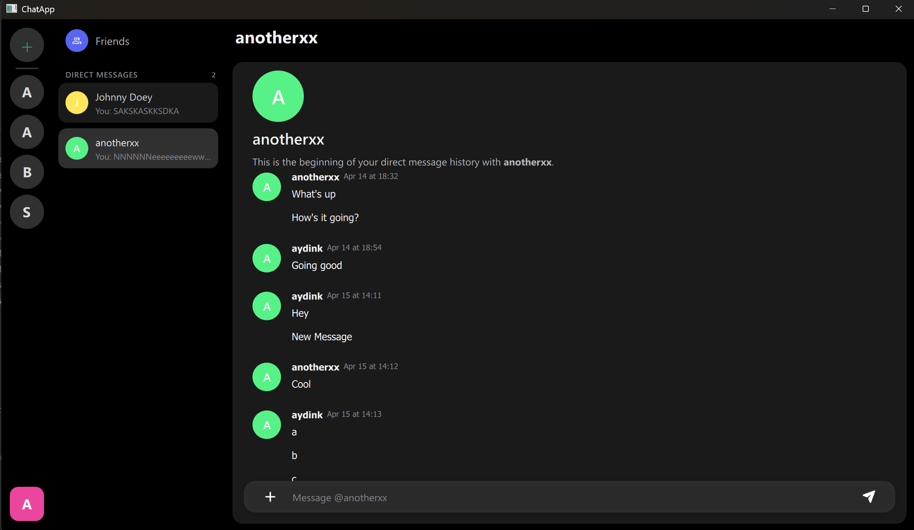
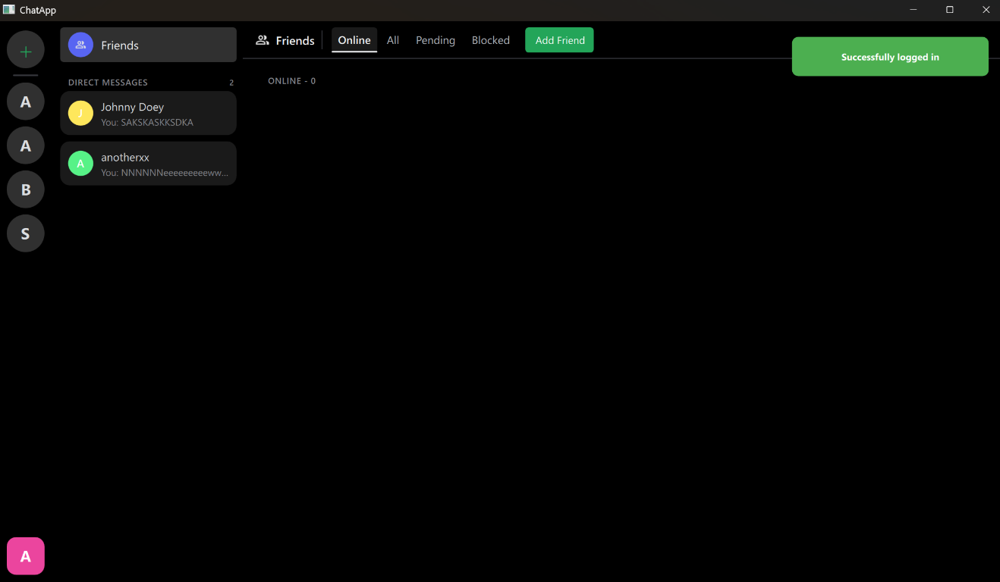
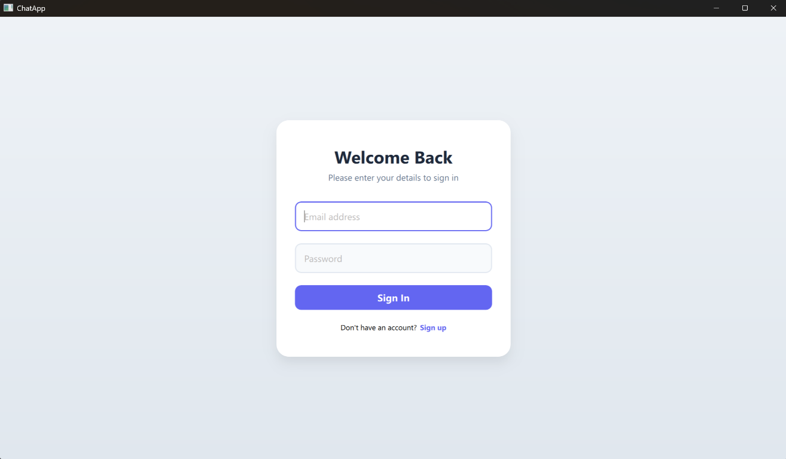

# ChatApp

A desktop chat client built with Qt 6 and QML. It talks to a separate backend over HTTP and WebSockets and supports direct messages, friends, presence, and servers.



## Features

- Sign up, log in, and log out (session is remembered between launches)
- Direct messages with conversation list, message history, and text selection
- Friends: add friends, pending requests, and a block list
- Real-time presence updates over WebSocket
- Create and browse servers (public or private)
- Toast notifications and a themed UI

## Requirements

- Qt 6.8 or newer with the **Quick** and **WebSockets** modules
- CMake 3.16 or newer
- A C++20 compiler
- The ChatApp backend running at `http://localhost:3000` (WebSocket endpoint at `ws://localhost:3000/ws`)

## Build and run

```sh
cmake -S . -B build -DCMAKE_PREFIX_PATH=/path/to/Qt/6.8.x/<kit>
cmake --build build --config Release
```

Then run the `appChatApp` executable from the build directory. You can also open `CMakeLists.txt` in Qt Creator and run it from there.

## Configuration

The backend addresses are currently hard-coded:

| Purpose   | Location                                                  | Default                   |
| --------- | --------------------------------------------------------- | ------------------------- |
| REST API  | `BASE_URL` in [networkClient.cpp](src/core/networkClient.cpp)   | `http://localhost:3000`   |
| Presence  | `WS_BASE_URL` in [presenceManager.cpp](src/core/presenceManager.cpp) | `ws://localhost:3000/ws`  |

Change these and rebuild to point the client at a different server.

## Project structure

```
Main.qml, Theme.qml, ToastManager.qml   Application root and singletons
views/                                  Top-level screens (auth, main, DMs, friends, panels)
components/                             Reusable QML components (auth, dm, friends, dialogs)
src/core/                               C++ clients and managers (network, auth, DMs, friends, presence, servers)
src/models/                             C++ list models exposed to QML
src/helpers/                            Small C++ helpers
assets/                                 Icons and images
```

## Screenshots

**Direct messages**


**Friends**



**Login**


